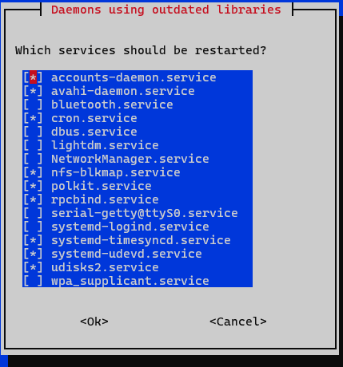

# Server Setup

Diese Dokumentation beschreibt die vollständige Einrichtung des Servers – von der ersten SSH-Verbindung bis zur laufenden App.  
Sie richtet sich auch an Personen ohne Linux-Vorkenntnisse und funktioniert auf einem frischen Raspberry Pi OS.

---

## 0. Voraussetzungen 
### Einloggen mit SSH
-	Verbinden sie sich zuerst über LAN oder WLAN mit dem selben Netz wie der Raspberry Pi.


```bash
ssh nutzername@ip-adresse
```
Bsp.: ssh mustermann@192.168.24.110
- Nutzername und ip-adresse sind Platzhalter für den Nutzernamen bzw. die IP-Adresse des Raspberry
-	Eingeben des Nutzerpassworts (Beim Eintippen erscheinen keine Zeichen)
-	Beim erstmaligen Verbindungsaufbau fragt das System nach einem Fingerprint. Sie werden gefragt ob sie die Verbindung fortsetzen möchten. (yes/no/[fingerprint])

```bash
yes
```
- No und fingerprint sind in diesem Fall zu vernachlässigen
- Passwort eingeben (Wurde beim ersten aufsetzen des Pis erstellt)

### Datum konfigurieren
```bash
sudo date -s "yyyy-mm-dd hh:mm:ss"
```
- Passwort eingeben
- Datum in dem Format einstellen, da sonst das Updaten im nächsten Schritt nicht funktioniert.

### Pakete aktualisieren
```bash
sudo apt update && sudo apt upgrade -y
```
Passwort eingeben

> Aktualisiert die Paketlisten und installiert alle verfügbaren Updates.  
> Das `-y` beantwortet Rückfragen automatisch mit „Ja".

### Benötigte Pakete installieren

```bash
sudo apt install -y git curl
```

> `git` wird zum Herunterladen des App-Quellcodes benötigt.  
> `curl` ist ein nützliches Werkzeug für Netzwerkabfragen.

### Aktuelle IP-Adresse herausfinden

```bash
hostname -I
```

> Zeigt die aktuelle (noch dynamische) IP-Adresse des Pi an.  
> Diese wird für den ersten SSH-Login und für die spätere statische IP benötigt.

---

## 1. Statische IP-Adresse einrichten

Eine statische IP stellt sicher, dass der Pi immer unter derselben Adresse erreichbar ist – auch nach einem Neustart.  
Die folgenden Schritte können entweder direkt am Pi oder bereits per SSH ausgeführt werden.

### 1.1 Verbindungsnamen ermitteln

```bash
nmcli connection show
```

> In der Ausgabe die Zeile mit `DEVICE: eth0` suchen. Der gesuchte Name steht in der Spalte `NAME`.

**Beispiel-Ausgabe:**

```
NAME             UUID                                  TYPE      DEVICE
netplan-eth0     75a1216a-9d1a-30cd-8aca-ace5526ec021  ethernet  eth0
```

In diesem Beispiel lautet der Verbindungsname `netplan-eth0`. Dieser Name wird in den folgenden Befehlen verwendet.

### 1.2 Statische IP-Konfiguration setzen

```bash
sudo nmcli connection modify netplan-eth0 \
  ipv4.method manual \
  ipv4.addresses 192.168.24.110/24 \
  ipv4.gateway 192.168.24.254 \
  ipv4.dns "172.28.28.3 192.168.24.254" \
  ipv4.dns-search "r324.local" \
  ipv6.method disabled \
  connection.autoconnect yes
```

> Der Backslash `\` am Ende jeder Zeile setzt den Befehl in der nächsten Zeile fort.  
> Alternativ kann der gesamte Befehl in einer einzigen langen Zeile geschrieben werden.

**Bedeutung der Parameter:**

|Parameter|Bedeutung|
|---|---|
|`ipv4.method manual`|Schaltet von automatisch (DHCP) auf statisch um|
|`ipv4.addresses 192.168.24.110/24`|Statische IP; `/24` entspricht Subnetzmaske `255.255.255.0`|
|`ipv4.gateway 192.168.24.254`|Router-Adresse für den Internetzugang|
|`ipv4.dns "172.28.28.3 192.168.24.254"`|DNS-Server für Namensauflösung (primär + Fallback)|
|`ipv4.dns-search "r324.local"`|Suchdomain – `printer` wird automatisch zu `printer.r324.local`|
|`ipv6.method disabled`|IPv6 deaktivieren (wird hier nicht benötigt)|
|`connection.autoconnect yes`|Verbindung startet automatisch beim Systemstart|

### 1.3 Konfiguration aktivieren

```bash
sudo nmcli connection down netplan-eth0
sudo nmcli connection up netplan-eth0
```

> `connection down` trennt die Verbindung, `connection up` baut sie mit den neuen Einstellungen neu auf.

> **Achtung (SSH):** Wird dieser Schritt per SSH ausgeführt, bricht die Verbindung beim `down`-Befehl ab.  
> Danach muss man sich mit der **neuen statischen IP** (`192.168.24.110`) erneut einloggen.
>
> Bei erneutem login wird dieser Fehler erscheinen:
> 
```bash
C:\Users\xxx>ssh username@ipadresse
@@@@@@@@@@@@@@@@@@@@@@@@@@@@@@@@@@@@@@@@@@@@@@@@@@@@@@@@@@@
@    WARNING: REMOTE HOST IDENTIFICATION HAS CHANGED!     @
@@@@@@@@@@@@@@@@@@@@@@@@@@@@@@@@@@@@@@@@@@@@@@@@@@@@@@@@@@@
IT IS POSSIBLE THAT SOMEONE IS DOING SOMETHING NASTY!
Someone could be eavesdropping on you right now (man-in-the-middle attack)!
It is also possible that a host key has just been changed.
The fingerprint for the ED25519 key sent by the remote host is
SHA256:xxxxxxxxxxxxxxxxxxxxxxxxxxxxxxxxxxxx (Bsp. Wert)
Please contact your system administrator.
Add correct host key in C:\\Users\\xxx/.ssh/known_hosts to get rid of this message.
Offending ED25519 key in C:\\Users\\xxx/.ssh/known_hosts:4
Host key for "ipadresse" has changed and you have requested strict checking.
Host key verification failed.
```

 Geh in die Datei ```C:\\Users\\xxx/.ssh/known_hosts``` und lösche den Inhalt.

 Verbinde dich dann erneut mit der richtigen IP-Adresse. (Schritt 0)

### 1.4 Konfiguration prüfen

```bash
ip a show eth0
ip route
cat /etc/resolv.conf
```

**Erwartete Ergebnisse:**

- `ip a show eth0` zeigt `192.168.24.110/24` ohne den Zusatz `dynamic`
- `ip route` zeigt eine Default-Route über `192.168.24.254`
- `/etc/resolv.conf` enthält die konfigurierten DNS-Server

---


## 2. Benutzer anlegen

Ein Linux-Server kann mehrere Benutzer haben. Jeder Benutzer hat eigene Rechte und ein eigenes Passwort.  
Wir legen zwei Benutzer an: einen normalen Nutzer (`willi`) und einen Fernzugriffs-Nutzer (`fernzugriff`).

### Normaler Nutzer `willi`

```bash
sudo useradd -m -s /bin/bash willi
```

> `useradd` legt einen neuen Benutzer an.  
> `-m` erstellt automatisch ein Heimverzeichnis (`/home/willi`).  
> `-s /bin/bash` setzt die Standard-Shell auf Bash.  
> `sudo` führt den Befehl mit Administratorrechten aus.

Neues Passowrt für Willi anlegen:
```bash
sudo passwd willi
# Passwort eingeben: willispasswd
```

> `passwd` setzt das Passwort für den angegebenen Benutzer.  
> Nach dem Befehl wird man zweimal nach dem Passwort gefragt (Eingabe + Bestätigung).

### Fernzugriff-Nutzer mit Root-Rechten

Dieser Nutzer wird speziell für SSH-Fernzugriff angelegt und erhält dieselben Rechte wie `root` (der Administrator).

```bash
sudo useradd -o -u 0 -g 0 -m -s /bin/bash fernzugriff
```

> `-u 0` weist dem Nutzer die User-ID 0 zu – das ist die ID des `root`-Benutzers.  
> `-g 0` setzt die Gruppen-ID auf 0 (ebenfalls root).  
> `-o` erlaubt es, eine bereits vergebene ID (0) erneut zu verwenden.  
> Der Nutzer hat damit vollständige Administratorrechte.

Neues Passwort anlegen für Fernzugriff:
```bash
sudo passwd fernzugriff
# Passwort eingeben: sshaccess
```

### SSH-Login für Root erlauben

Standardmäßig ist der direkte Login als Root-Nutzer aus Sicherheitsgründen gesperrt – das wird hier aktiviert.

```bash
sudo sed -i 's/#PermitRootLogin.*/PermitRootLogin yes/' /etc/ssh/sshd_config
```

> `sed` sucht in der SSH-Konfigurationsdatei nach der Zeile `#PermitRootLogin` und ersetzt sie durch `PermitRootLogin yes`.  
> Das `#` am Anfang einer Zeile bedeutet in Konfigurationsdateien „deaktiviert" (Kommentar).

```bash
sudo systemctl restart sshd
```

> Startet den SSH-Dienst neu, damit die Änderung wirksam wird.

---

## 3. Docker installieren

Docker ist eine Software, mit der Anwendungen in sogenannten „Containern" ausgeführt werden.  
Ein Container verhält sich wie ein kleiner, isolierter Computer innerhalb des Servers.

### Docker Engine

```bash
sudo apt install -y docker.io
```

> `apt` ist der Paketmanager von Debian/Raspberry Pi OS.  
> `docker.io` ist das Docker-Paket.

### Docker-Dienst aktivieren

```bash
sudo systemctl enable docker
sudo systemctl start docker
```

> Stellt sicher, dass Docker auch nach einem Neustart automatisch läuft.

### Docker Compose

Docker Compose ermöglicht es, mehrere Container gleichzeitig über eine Konfigurationsdatei (`docker-compose.yml`) zu starten und zu verwalten.

```bash
sudo apt-get install -y docker-compose
```

>Sollte dieses Fenster erscheinen gehen sie mit Tab zu ok und bestätigen sie mit Enter.
### Aktuellen Benutzer zur Docker-Gruppe hinzufügen (optional)

```bash
sudo usermod -aG docker $USER
```

> Damit kann Docker ohne `sudo` verwendet werden.  
> **Hinweis:** Diese Änderung wird erst nach einem Neu-Login wirksam.
>
> Mit "Exit" ausloggen und über ssh erneut verbinden.

---

## 4. TodoList-App deployen

Jetzt wird der Quellcode der App von GitHub heruntergeladen und mit Docker gestartet.

### Repository klonen

```bash
cd /opt
```

> `cd` wechselt in das Verzeichnis `/opt`.  
> `/opt` ist unter Linux der übliche Speicherort für manuell installierte Anwendungen.

```bash
sudo git clone https://github.com/SomeRandoLameo/TodoList.git
```

> `git clone` lädt eine vollständige Kopie des Projekts von GitHub herunter.  
> Es wird automatisch ein neuer Ordner `TodoList` erstellt.

```bash
cd TodoList
```

> Wechselt in den soeben erstellten Projektordner.

### App starten

```bash
sudo docker-compose up -d
```

> `docker-compose up` liest die Datei `docker-compose.yml` und startet alle darin definierten Container.  
> `-d` steht für „detached" – die Container laufen im Hintergrund.  
> Beim ersten Start wird das Docker-Image gebaut, was einige Minuten dauern kann.

### App aufrufen

Die App ist danach erreichbar unter:

```
http://192.168.24.110:5001
```

---

## Zusammenfassung

| Schritt                      | Befehl(e)                           |
| ---------------------------- | ----------------------------------- |
| SSH aktivieren               | `systemctl enable/start ssh`        |
| System aktualisieren         | `apt update && apt upgrade`         |
| git & curl installieren      | `apt install git curl`              |
| Statische IP setzen          | `nmcli connection modify`           |
| Nutzer `willi` anlegen       | `useradd`, `passwd`                 |
| Nutzer `fernzugriff` anlegen | `useradd`, `passwd`                 |
| SSH Root-Login aktivieren    | `sed`, `systemctl restart sshd`     |
| Docker installieren          | `apt install docker.io`             |
| Docker Compose installieren  | `apt-get install docker-compose`    |
| App deployen                 | `git clone`, `docker-compose up -d` |

---

> **Sicherheitshinweis:** Diese Dokumentation enthält zur Demonstration Passwörter im Klartext.  
> Bewahre diese Datei nicht ungeschützt auf und teile sie nicht öffentlich.